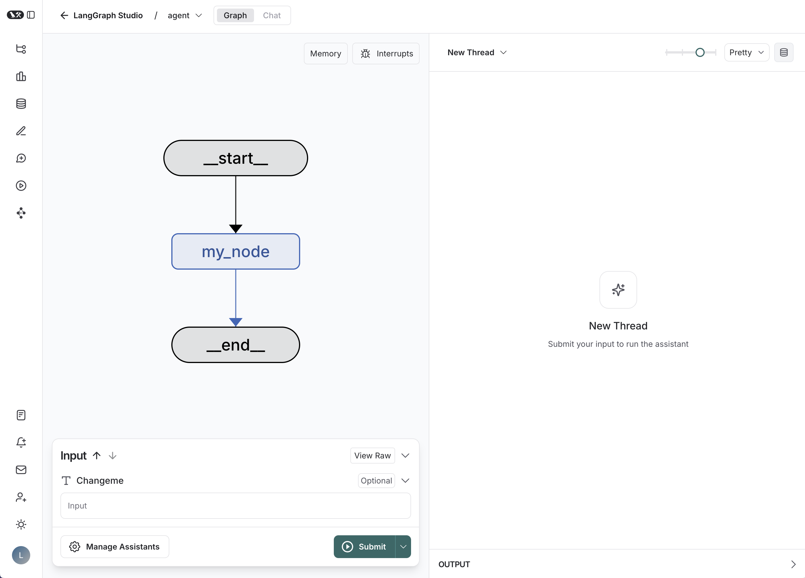

# Financial Multi-Agent RAG System - LangGraph Server

[](https://github.com/langchain-ai/new-langgraph-project/actions/workflows/unit-tests.yml)
[](https://github.com/langchain-ai/new-langgraph-project/actions/workflows/integration-tests.yml)

This is a sophisticated multi-agent financial RAG (Retrieval-Augmented Generation) system built using [LangGraph](https://github.com/langchain-ai/langgraph), designed to run as a [LangGraph Server](https://langchain-ai.github.io/langgraph/concepts/langgraph_server/#langgraph-server) and debuggable with [LangGraph Studio](https://langchain-ai.github.io/langgraph/concepts/langgraph_studio/).

<div align="center">
  
</div>

## Features

- **Multi-Agent Architecture**: Classifier, Retriever, RAG Processor, and Context Sufficiency agents
- **Financial Data Processing**: Handles stock prices, annual reports, call transcripts
- **Vector Store Integration**: ChromaDB for document storage and retrieval  
- **REST API Server**: Full LangGraph Server API for production deployment
- **Streaming Support**: Real-time response streaming
- **Thread Management**: Persistent conversation threads
- **Checkpointing**: State persistence and recovery

## Architecture

The system uses a coordinated multi-agent approach:

1. **Classifier Agent**: Determines document type needed (price data, reports, transcripts)
2. **Retriever Agent**: Fetches and processes relevant financial documents
3. **RAG Processor**: Generates answers using retrieved context
4. **Document Sufficiency**: Validates context quality and completeness

## Getting Started

### Prerequisites

- Python 3.9+
- LangSmith API key (for tracing)
- LangGraph CLI
- Your LLM API keys (OpenAI, Anthropic, etc.)

### Installation

1. Clone and navigate to the project directory:

```bash
cd path/to/your/app
```

2. Install dependencies:

```bash
pip install -e . 
pip install "langgraph-cli[inmem]"
```

3. Configure environment variables:

```bash
# Copy and edit the .env file
cp .env .env.local
# Edit .env.local with your API keys
```

Required environment variables:
- `LANGSMITH_API_KEY`: Your LangSmith API key
- `OPENAI_API_KEY` or `ANTHROPIC_API_KEY`: LLM provider keys
- `GOOGLE_API_KEY`: For additional data sources

### Running the Server

#### Development Mode

Start the development server with hot reloading:

```bash
langgraph dev
```

The server will start on `http://localhost:2024` with:
- API documentation at `http://localhost:2024/docs`
- LangGraph Studio at `https://smith.langchain.com/studio`

#### Production Mode

Build and run with Docker:

```bash
# Build the Docker image
langgraph build -t financial-rag-server

# Run with docker-compose (includes Redis/PostgreSQL)
docker-compose up -d

# Or run the container directly
docker run -p 8123:8000 --env-file .env financial-rag-server
```
## API Usage

### REST API

Once the server is running, you can interact with it using HTTP requests:

```bash
# Check server health
curl http://localhost:2024/ok

# Create a new thread
curl -X POST http://localhost:2024/threads \
  -H "Content-Type: application/json" \
  -d '{}'

# Send a query (replace THREAD_ID with actual thread ID)
curl -X POST http://localhost:2024/threads/THREAD_ID/runs/wait \
  -H "Content-Type: application/json" \
  -d '{
    "assistant_id": "agent",
    "input": {
      "query": "What is Apple'\''s current stock price?",
      "messages": [{"role": "user", "content": "What is Apple'\''s current stock price?"}],
      "documents_used": [],
      "price_data": {},
      "vector_store_updated": false,
      "use_existing_data": false,
      "chat_history": null
    }
  }'
```

### Python SDK

```python
from langgraph_sdk import get_client

# Connect to the server
client = get_client(url="http://localhost:2024")

# Create a thread
thread = await client.threads.create()
thread_id = thread["thread_id"]

# Send a query and get streaming response
async for chunk in client.runs.stream(
    thread_id,
    "agent",
    input={
        "query": "Show me Microsoft's financial performance",
        "messages": [{"role": "user", "content": "Show me Microsoft's financial performance"}],
        "documents_used": [],
        "price_data": {},
        "vector_store_updated": False,
        "use_existing_data": False,
        "chat_history": None
    },
    stream_mode="updates"
):
    print(f"Event: {chunk.event}")
    print(f"Data: {chunk.data}")
```

### Testing

Run the included test scripts:

```bash
# Python SDK test
python test_server.py

# Synchronous test
python test_server.py sync

# Bash/cURL test (Linux/Mac)
chmod +x test_server.sh
./test_server.sh
```

## Configuration

The system supports various configuration options through environment variables:

### Required Variables
- `LANGSMITH_API_KEY`: Your LangSmith API key for tracing
- `GOOGLE_API_KEY`: For accessing financial data sources

### Optional Variables
- `OPENAI_API_KEY`: For OpenAI models
- `ANTHROPIC_API_KEY`: For Anthropic models
- `LOG_LEVEL`: Logging level (DEBUG, INFO, WARNING, ERROR)
- `CHROMA_PERSIST_DIRECTORY`: ChromaDB storage location

### Server Configuration
- `LANGGRAPH_AUTH_TYPE`: Authentication type (noop for development)
- `POSTGRES_URI_CUSTOM`: Custom PostgreSQL connection (production)
- `REDIS_URI_CUSTOM`: Custom Redis connection (production)

## Development and Debugging

### LangGraph Studio

1. Start the development server:
   ```bash
   langgraph dev
   ```

2. Open LangGraph Studio at `https://smith.langchain.com/studio`

3. Connect to your local server at `http://localhost:2024`

4. Debug your graph visually:
   - See state transitions
   - Edit past states
   - Rerun from specific points
   - Hot reload changes

### Local Development

- Edit files in `src/` to modify agent behavior
- Changes are automatically applied via hot reload
- Check logs in the terminal for debugging
- Use the `/docs` endpoint for API documentation

## Deployment

### Docker Deployment

```bash
# Build image
langgraph build -t financial-rag-server

# Deploy with docker-compose
docker-compose up -d

# Or standalone
docker run -p 8123:8000 --env-file .env financial-rag-server
```

### Production Considerations

1. **Database**: Use PostgreSQL for persistence
2. **Caching**: Use Redis for improved performance  
3. **Authentication**: Configure proper authentication
4. **Monitoring**: Enable LangSmith tracing
5. **Scaling**: Use multiple replicas with load balancing

## Troubleshooting

### Common Issues

1. **Import Errors**: Ensure all dependencies are installed
2. **API Key Issues**: Check environment variables are set correctly
3. **Port Conflicts**: Change port with `langgraph dev --port 8080`
4. **Memory Issues**: Check ChromaDB permissions and disk space

### Getting Help

- Check the [LangGraph Documentation](https://langchain-ai.github.io/langgraph/)
- Review logs in the terminal
- Use LangGraph Studio for visual debugging
- Check the `/docs` endpoint for API reference

## Contributing

1. Fork the repository
2. Create a feature branch
3. Make your changes
4. Test with the included test scripts
5. Submit a pull request

## License

This project is licensed under the MIT License - see the LICENSE file for details.
